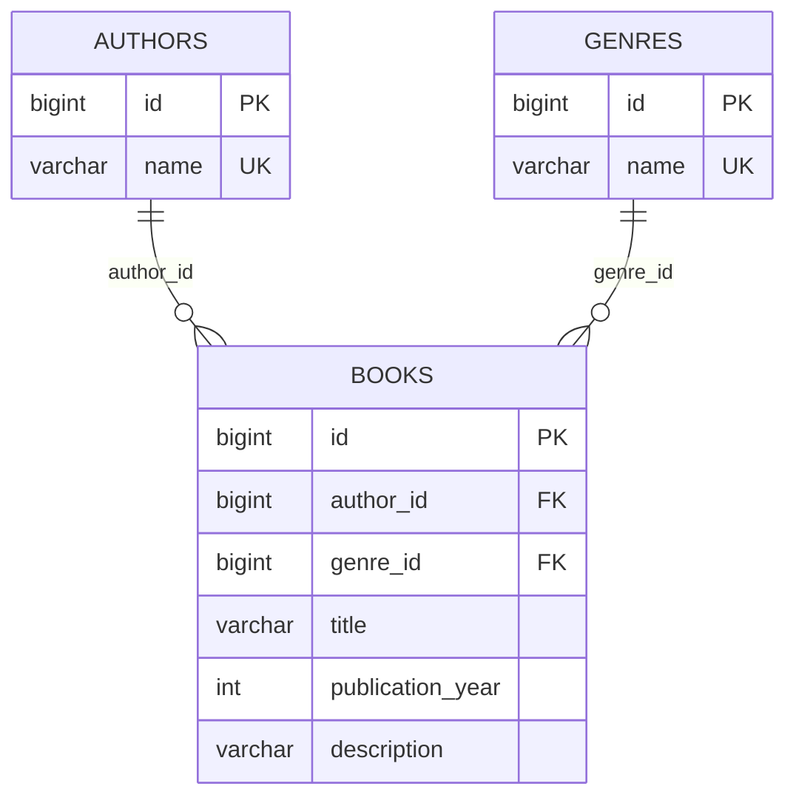

# library-mvc-security

Итоговый учебный проект «Каталог книг»: Spring Boot + Spring MVC + Thymeleaf + Spring Data JPA (MySQL) + Spring Security (HTTP Basic, пользователи в таблице БД).

## База данных

Все SQL-команды лежат в папке `database/`:

| Файл | Что делает |
|---|---|
| `01_create_database.sql` | создаёт базу `library_db` |
| `02_create_tables.sql` | создаёт таблицы `genres`, `authors`, `books`, первичные и внешние ключи, UNIQUE, CHECK, индексы; добавляет начальные данные |
| `03_test_queries.sql` | проверочные запросы с JOIN и примеры нарушения ограничений |
| `04_create_users_table.sql` | таблица `users` для Spring Security (логин, BCrypt-хеш пароля, роль) |
| `er-diagram.png` | схема связей таблиц (ER-диаграмма) |

### Схема связей



- один автор имеет много книг (1:N), один жанр включает много книг (1:N);
- внешние ключи `ON DELETE RESTRICT`: нельзя удалить автора или жанр, у которого есть книги;
- `CHECK`: год издания от 1450 до 2100.

## Запуск

1. Установите **MySQL Server 8** и **MySQL Workbench** (проще всего через MySQL Installer) и запомните пароль `root`.
2. В Workbench подключитесь к серверу и выполните `database/01_create_database.sql`.
3. Затем выполните `database/02_create_tables.sql` (он сам переключается на `library_db`), а после него `database/04_create_users_table.sql`.
4. В `src/main/resources/application.properties` впишите свой пароль в `spring.datasource.password`.
5. Запустите `mvn spring-boot:run` и откройте http://localhost:8080

Hibernate настроен в режиме `validate`: он не создаёт таблицы, а только проверяет, что они совпадают с сущностями.

## Архитектура

```
Controller -> Service -> Repository (Spring Data JPA) -> MySQL
                |
     Book (модель формы)  <->  BookEntity / AuthorEntity / GenreEntity (таблицы)
```

Пакеты: `controller`, `service`, `repository`, `entity` (сущности БД), `model` (модель формы), `exception`.


## Безопасность (Spring Security)

- **Аутентификация:** HTTP Basic. Браузер показывает окно логина и пароля и отправляет их в заголовке `Authorization` с каждым запросом.
- **Пользователи** хранятся в таблице `users` (`UserEntity`, `UserRepository`). `DbUserDetailsService` загружает пользователя из БД для Spring Security.
- **Пароли** хранятся в виде хеша BCrypt, открытый пароль в БД не попадает.
- **Роли:** `ADMIN` (может добавлять, изменять и удалять книги) и `USER` (только просмотр).
- **Пользователи по умолчанию** (создаются при первом запуске, если таблица пуста): `admin / admin123` и `user / user123`.
- **Регистрация:** `/register` создаёт нового пользователя с ролью `USER`.

| Адрес | Кто имеет доступ |
|---|---|
| `/`, `/register`, `/css/**` | все |
| `/books`, `/books/{id}`, `/authors` | любой вошедший пользователь |
| `/books/new`, `/books/{id}/edit`, любые POST в `/books` | только ADMIN |

CSRF-защита Spring Security включена: формы Thymeleaf (`th:action`) автоматически получают скрытый токен.

## Чек-лист проверки

- [ ] Открыть `/` без входа: страница открывается, в меню есть «Регистрация»
- [ ] Открыть `/books`: появляется окно логина; Отмена показывает страницу 401
- [ ] Войти как `user / user123`: список виден, кнопок «Добавить», «Изменить», «Удалить» нет
- [ ] Как `user` открыть `/books/new` вручную: страница 403
- [ ] Войти как `admin / admin123`: видны все кнопки, CRUD работает
- [ ] Неверный пароль: окно логина появляется снова
- [ ] Зарегистрировать нового пользователя, затем войти им
- [ ] `SELECT id, username, password, role FROM users;` в Workbench: пароли в виде хешей `$2a$...`
